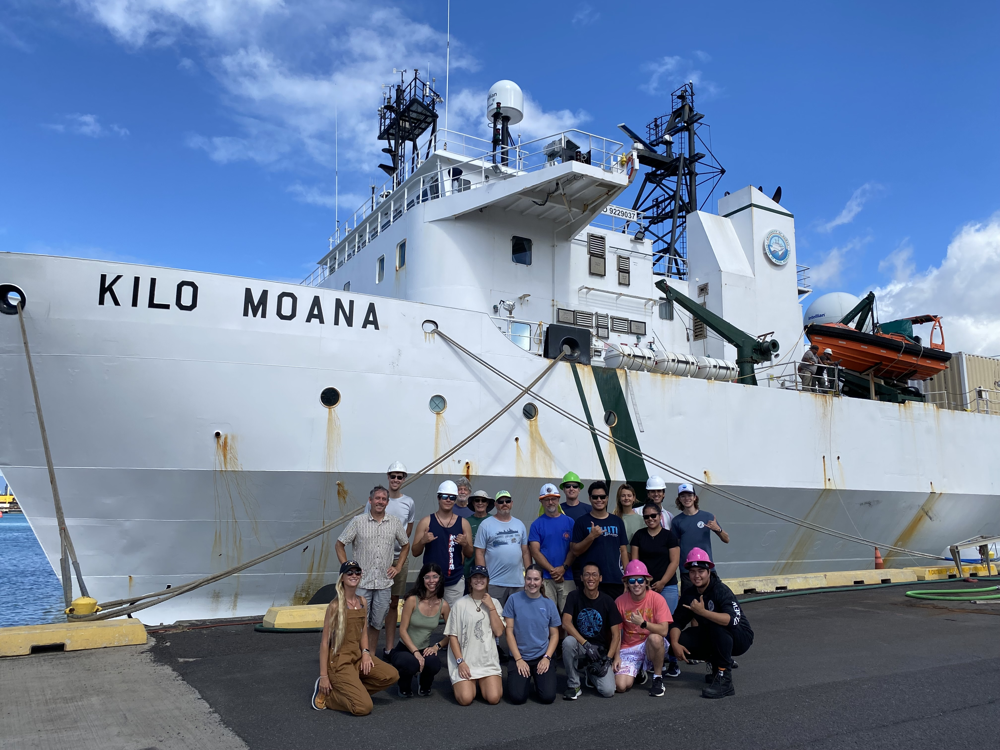

# OCN 682 Final Project: Keanu Rochette-Yu Tsuen

### [Final Project Link](https://keanuryt.github.io/blog/) via Keanu's Website 

### Project Description 

The island mass effect is said to enrich near shore waters with island derived materials. 
This study aims to understand the changes in physical parameters with depth and 
the changes in micro-plankton communities from near shore to offshore. 

**Author**: Keanu Rochette-Yu Tsuen*, Devin Hogate, Craig Nelson, Ph.D.

**Contents**: There are 2 folders and a README.md file in this repository.  
The "Oceanographic_data" folder is dedicated to building a shiny app.  
The "Data_manipulation" folder is dedicated to data file conversion, data clean-up and 
manipulation and the re-writing of clean files.  
Data manipulation had be done separately from the RShiny app folder, otherwise, 
the app would have trouble rendering. 

**Data**:

- CTD data were taken at four different stations off the West Coast of Oahu. 
- FCM data were measured from water samples taken during the cruise.  

More details about the cruise are located in the "oceanographic_metadata.Rmd" file.

